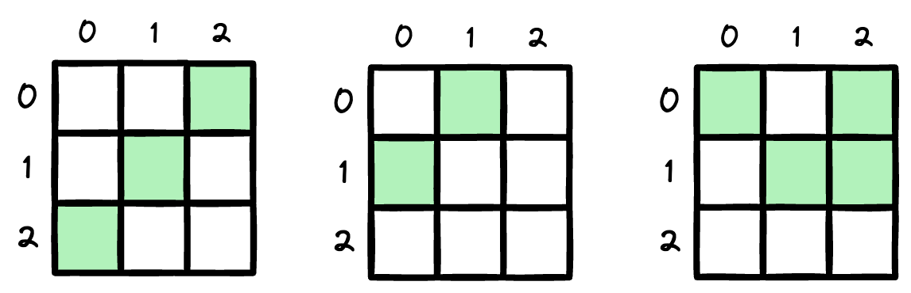
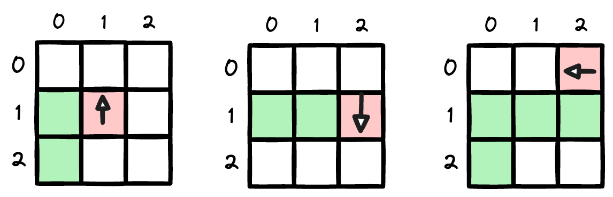

# Teaching an AI Agent to Play Snake Game

This part I of a series of interactive web application that teaches curious beginners how to use reinforcement learning to train a computer how to play the classical snake game. This interactive experience will walk readers through the process of developing the algorithms and adding multiple variations to the game such as solo agent playing or mutli agents compete to get the highest score.

# Key Components of Reinforcement Learning
Reinforcement learning is a class of artificial intelligence that teaches a machine to **maximize an objective** through its **direct interaction with the environment**. Unlike supervised learning where the machine learns from labeled input data (e.g., classification, regression) and unsupervised learning where the machine learns from unlabeled input data (e.g., clustering), RL _learns from its own experience with no input data_. There are various RL algorithms but in this tutorial, we will focus on a model-free and tabular method called **Q-learning**.

# Game State Generation
> How Many Valid Game States Are There in a 3D-Grid Snake Game?

This section explains how to derive the total number of valid game states in a 3x3 grid snake game. I will go through the derivation for each length of the snake. First, the most important question to ask is:  What does a valid game state actually mean? When playing the snake game, at each time step, the information we want to know is:
- Where is the snake's head located?
- Which direction is the snake's head facing?
- What is the current body segment of the snake?
- Where is the food located, non-overlapped with the snake’s body?

The combination of all the above information constitutes a game state at a given discrete time step. But why do we need to know all of these? Because it helps the snake make a decision on what to do next, and it enables us to design a reward system that rewards and penalizes the learning agent. For example, if the snake’s head is facing East (rightward →), it will be penalized if it turns the opposite direction (←) because of self-collision. Similarly, knowing about the body segment also helps us detect when the snake hits itself. 

What about the valid bit? It means the snake’s body shape and its head’s direction should not violate the rules of the game. Specifically, the snake’s body shape should consist of continuous/adjacent segments, and the snake’s head direction should be valid for its location.  

**Figure 1**. Examples of invalid game states regarding body shape. The snake’s body shapes are disrupted and do not form a continuous adjacent segment.

**Figure 2**. Examples of invalid game states regarding head direction. The red cells represent the snake’s head, and the arrows show its invalid direction. In the first grid, if the snake's head is located on cell (1,1) for its given shape, then the only valid direction for its head is → (rightward). To clarify, the snake can turn its head in the arrow direction in the next time step, but at the given time step, its direction cannot be in that direction. Similar logic applies to the other two grids.

## Maththematical Derivation

## Algorithm

# Q-Learning Algorithm
# Results
# References
